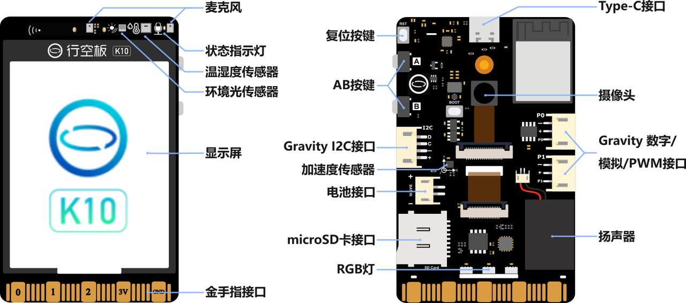

# K10-IDF-Examples

> 基于 ESP-IDF 的行空板 K10 示例代码库 

---

## 🧠 开发板简介

](attachments/c8c81c078e47fd70b6c05ff42d0fee2a.png)

行空板K10是一款专为快速体验和学习人工智能而设计的开发学习板，100%采用国产芯片，知识产权自主可控，符合信息科技课程中编程学习、物联网及人工智能等教学需求。该板集成：

- 2.8寸LCD 彩屏
- 摄像头
- 麦克风、扬声器
- 多种传感器（温湿度、光照、IMU 等）
- RGB 指示灯
- WiFi & 蓝牙模块
- 丰富的扩展接口

该仓库旨在为使用 ESP-IDF 进行底层开发的用户，提供完整的示例代码，涵盖 AI 与 IoT 应用场景。

接口标识：

原理图：

 [DFR0992-UNIHIKER-K10-原理图V1.2.pdf.pdf](attachments\DFR0992-UNIHIKER-K10-原理图V1.2.pdf.pdf) 

---

## 📁 示例列表 

| 示例 | 说明 |
| ---- | ---- |
|      |      |
|      |      |
|      |      |
|      |      |
|      |      |

👉 更多示例持续更新中……

---

## 🛠️ 开发环境 

- **开发框架 | Framework**：ESP-IDF v5.4.1
- **芯片平台 | Chipset**：ESP32-S3 N16R8 
- **推荐工具 | Recommended**：VS Code 

---

## 📌 注意事项

- 本仓库中的大部分示例基于 ESP-IDF 官方示例修改或整理而来，适配行空板 K10 硬件平台，便于教学与快速上手。  
  具体内容可参考 [ESP-IDF 官方编程指南](https://docs.espressif.com/projects/esp-idf/zh_CN/latest/esp32/index.html)。
- 某些示例依赖额外组件或第三方库，请查看每个示例文件夹内的 `README.md`。
- 若遇到驱动安装、串口连接等问题，请参阅官方 ESP-IDF 文档获取详细说明。

---

## 📖 许可证

MIT License

---

## ✍️ 作者 

Created by DuRuofu

欢迎反馈与贡献！Welcome PRs and Issues 🙌
